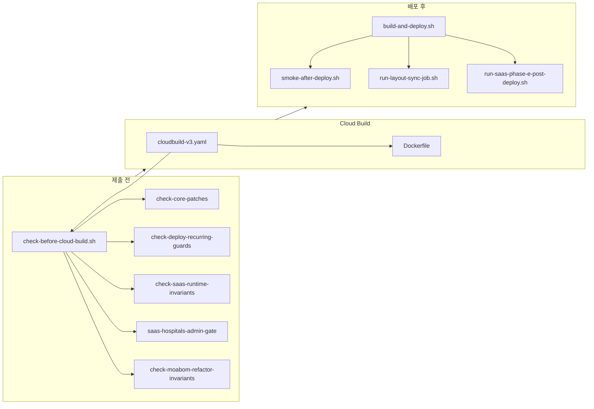

# deploy/ — Moabom 운영 SSOT

Cloud Build → Cloud Run 배포 파이프라인과 검증 게이트. **운영 이미지는 이 경로로만** 만든다.

런타임 계약(Identity / DataGate / AuthBoot): [`RUNTIME-CONTRACTS.md`](RUNTIME-CONTRACTS.md).



## 핵심 파일 (삭제·이동 금지)

| 파일 | 역할 |
|------|------|
| `cloudbuild-v3.yaml` | `_IMAGE_TAG` SSOT, Cloud Build 단일 진입 |
| `Dockerfile` | 운영 이미지 (assets·vendor·dist·entrypoint) |
| `cloudrun-entrypoint.sh` | 부팅: migrate, SaaS sync, layout retry |
| `nginx-cloudrun.conf` | Run nginx (gzip, `/api/` Laravel-first) |
| `supervisord.conf` | php-fpm + nginx |
| `production.env.yaml` | Run 환경 변수 (시크릿은 Secret Manager) |
| `build-and-deploy.sh` | 검증 → submit → deploy → smoke → layout pipeline |
| `run-post-deploy-layout-pipeline.sh` | **RF-24** 이미지 재빌드 없이 reconcile+sync+cache bust |
| `check-before-cloud-build.sh` | 제출 전 통합 게이트 (v7+v8) |
| `DEPLOY-RECURRING-FAILURES.md` | RF 증상·원인·조치 카탈로그 |
| `MOABOM-TECH-DEBT-AUDIT.md` | Moabom 기술 부채 감사·정리 진행 SSOT |

## lib/ · ssot/

| 파일 | 역할 |
|------|------|
| `lib/gcp-env.sh` | GCP project·region·Run·SQL·시크릿 매핑 SSOT |
| `lib/image-tag.sh` | `cloudbuild-v3.yaml` `_IMAGE_TAG` 읽기 |
| `lib/cloud-run-artisan-job.sh` | Cloud Run Job 래퍼 (`*` 인자 거부 RF-12) |
| `lib/layout-sync-hash.sh` | layout JSON·lang-pack 지문 → 조건부 layout sync |
| `ssot/moabom-system.config.php` | → `modules/moabom-system/config/` 복사 원본 |
| `ssot/decomposition-api-compat.json` | 분리 모듈 API compat 계약 |
| `lib/post-deploy-migration-hash.sh` | migration·platform schema 지문 → auto migrate |
| `lib/content-manifest-hash.sh` | manifest 해시 공용 |
| `ssot/layout-sync-manifest.sha256` | 마지막 layout sync 입력 지문 |
| `ssot/post-deploy-manifest.sha256` | 마지막 post-deploy migration·Phase E 지문 |
| `seed-post-deploy-manifests.sh` | manifest 시드 (배포 후 성공 시 자동 갱신) |

## 검증 게이트 (`check-before-cloud-build.sh` 가 호출)

| 스크립트 | 검사 대상 |
|----------|-----------|
| `check-core-patches.sh` | `core-patches/moabom-core.patch` 정합성 |
| `check-g7-core-guard-regression.sh` | 코어 가드 주입 회귀 |
| `check-bundled-detach-regression.sh` | 활성 경로 `_bundled` 참조 0 |
| `check-bundle-budget.sh` | moabom-basic 번들 크기 (repo dist 있을 때) |
| `check-deploy-recurring-guards.sh` | RF-01~24 정적 가드 |
| `check-saas-runtime-invariants.sh` | SaaS·분리 모듈·entrypoint 배선 (대형) |
| `saas-hospitals-admin-gate.sh` | 업체 admin 레이아웃·i18n |
| `check-moabom-admin-basic-ssot.sh` | admin 템플릿 SSOT |
| `check-moabom-refactor-invariants.sh` | 리팩토링 불변식 |
| `smoke-social-auth.sh` | SNS OAuth 정적·구성 검증 |

## 배포 후·Job

| 스크립트 | 역할 |
|----------|------|
| `smoke-after-deploy.sh` | HTTP 스모크 (shell-boot, weather, 분리 모듈) |
| `run-layout-sync-job.sh` | template·module layout DB sync Job |
| `run-post-deploy-layout-pipeline.sh` | RF-24 layout-only (재빌드 금지 경로) |
| `run-saas-phase-e-post-deploy.sh` | Phase E (platform-migrate·permissions) |

## 배포 속도 (RF-23) · layout 분리 (RF-24)

| 항목 | 동작 |
|------|------|
| migrate | 기본 `auto` — migration 파일 변경 모듈만 Job |
| layout sync | manifest 해시 변경 시에만 ~9 Job |
| Phase E | platform migration·normalize 소스 변경 시에만 |
| Cloud Build check | 로컬 check 통과 시 inner step 생략 |
| Job boot | `MOABOM_CRJ_BOOT_SLEEP` 기본 10s |
| Job update | image/cmd/timeout 동일 시 `jobs update` 스킵 (RF-24) |
| layout 실패 | `_IMAGE_TAG` 금지 → `run-post-deploy-layout-pipeline.sh` |
| env-only 스모크 | `MOABOM_SMOKE_PROFILE=light` |

강제: `MOABOM_FORCE_POST_DEPLOY_MIGRATE=1` · `MOABOM_FORCE_LAYOUT_SYNC=1` · `MOABOM_FORCE_PHASE_E=1` · `MOABOM_CRJ_FORCE_JOB_UPDATE=1`

## min=0 콜드스타트 (RF-24)

| 항목 | 역할 |
|------|------|
| `MOABOM_ENTRYPOINT_DEFERRED_SYNC=false` | 운영 — 무거운 sync 는 배포 Job 만 |
| `cloudrun-deferred-sync.sh` | 로컬/docker — supervisord 백그라운드 sync |
| `/public/ready` | startup probe (DB ping) |
| `moabomShellBoot.ts` | 502/503 shell-boot 자동 재시도 |
| `setup-cloud-scheduler-warmup.sh` | 5분마다 `/ready` 워밍 |

## 이미지에 COPY되는 SaaS 헬퍼 (`Dockerfile`)

| 스크립트 | 역할 |
|----------|------|
| `saas-module-sync.sh` | 모듈 선언·layout refresh (수동/Job) |
| `saas-clone-tenant.sh` | 테넌트 DB 클론 |
| `saas-extension-bootstrap.sh` | `sync-package-extensions` |
| `saas-tenant-extension-sync.sh` | 테넌트 확장 insert-only/activate |

## entrypoint·invariant가 요구하는 래퍼 (이미지 밖에서도 존재해야 함)

| 스크립트 | 역할 |
|----------|------|
| `saas-template-layout-sync.sh` | layout sync 단일 래퍼 |
| `saas-tenant-admin-token-job.sh` | 테넌트 admin 토큰 Job |

## G7 upstream (배포와 별도 — `core:update` 전)

| 스크립트 | 역할 |
|----------|------|
| `check-upstream-prep.sh` | 패치·가드·bundled-detach·admin semantic CSS·dry-run 통합 |
| `sync-g7-admin-semantic-css.sh` | `sirsoft-admin_basic` `main.css` → `moabom-admin_basic` `g7-semantic.css` 동기화/검사 (`--check`) |
| `check-core-sync-regression.sh` | core:update sync 회귀 |
| `dry-run-upstream-patches.sh` | 패치 dry-run |
| `core-patches/*` | G7 overlay patch 적용 스크립트와 패치 — [`README.md`](core-patches/README.md) |
| `core-overlay/manifest.json` | overlay 파일 분류 SSOT. `check-core-patches.sh`가 패치 파일 목록과 비교 |

## 유틸

| 스크립트 | 역할 |
|----------|------|
| `secret-manager-bootstrap.sh` | 시크릿 1회 부트스트랩 |
| `docs/moabom-fcm.md` | FCM(Firebase) 푸시 env·Secret Manager·활성화 체크리스트 |
| `push-moabom-mek.sh` | GitHub push |
| `saas-config-cache-parity.sh` | 로컬 docker `config:cache` 후 tenant 격리 (선택) |

## 선택 SaaS 스모크 (미포함 — 있을 때만 실행)

`smoke-after-deploy.sh` 가 `deploy/` 아래에 아래 스크립트가 **있을 때만** 추가 실행한다. 기본 배포에는 포함하지 않으며, 없으면 SKIP (`MOABOM_STRICT_SMOKE=1` 이면 FAIL):

- `saas-wildcard-smoke.sh`
- `smoke-saas-tenant-shell-boot.sh`
- `e2e-tenant-isolation-dod.sh`
- `saas-platform-hospitals-smoke.sh`
- `saas-tenant-admin-smoke.sh`

## 빠른 명령

```bash
bash deploy/check-before-cloud-build.sh
./deploy/build-and-deploy.sh
IMAGE_TAG=vN bash deploy/run-layout-sync-job.sh   # async 배포 후 수동
bash deploy/check-upstream-prep.sh                # G7 upstream 전
bash deploy/sync-g7-admin-semantic-css.sh --check # admin 시맨틱 CSS parity
bash deploy/sync-g7-admin-semantic-css.sh         # drift 시 동기화 write
```

## 문서 SSOT

배포·RF 절차는 **본 README** + [`DEPLOY-RECURRING-FAILURES.md`](DEPLOY-RECURRING-FAILURES.md) + [`.cursor/rules/`](../.cursor/rules/) 만 따른다. 과거 실험 문서·장문 배경은 Git 이력에서만 참고한다.
